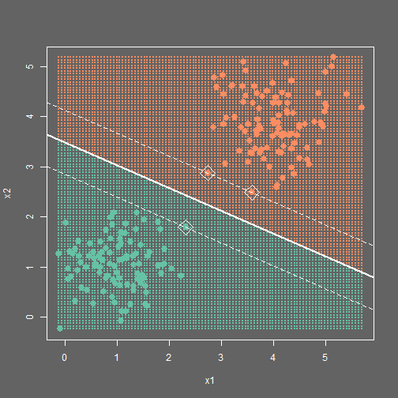

## Support Vector Machines interactive
by Jiri Hron

---

## Why SVM?
 
  1. Currently one of the most popular algorithms among Machine Learning
  community due to its effectivness
  2. Can be used both in classification and regression settings
  3. Elegant algorithm with non-trivial implementation and tuning

---

## Who can be interested?

 

  1. Teachers - to demonstrate in real-time how SVMs work with different tuning
  parameters and settings
  2. Students - who are currently studying SVMs and visual demonstrations
  help them understand
  3. Geeks - who have two minutes of time and are keen on machine learning, 
  algorithms or statistics

---

 

Application enables any user to quickly generate a data set and fit SVM to it 
with readily available possibility to try-out diffetent tuning parameters.

---

## Application capabilities

Based on this formula:

$$min_\theta C \sum_{i=1}^m \Big[ y^{(i)} cost_1(\theta^T f^{(i)})
    + (1 - y^{(i)}) cost_0 (\theta^T f^{(i)}) \Big]$$
    $$+ \frac{1}{2} \sum_{i=1}^n \theta_j^2$$ 
    

where $cost_1$ and $cost_0$ are 
corresponding Hinge loss functions for given class you can:

  * use Linear or Gaussian kernel function (here $f^{(i)}$)
  * adjust parameter $C$
  * change $\sigma$ when using Gaussian kernel
  * generate custom data set with two groups and train a new SVM instance on it

